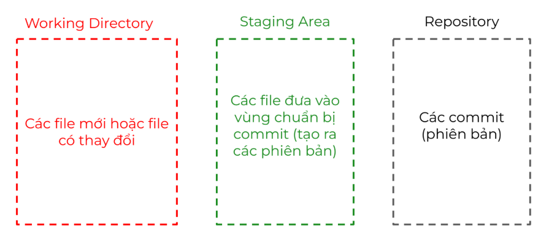
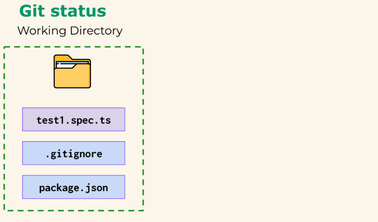
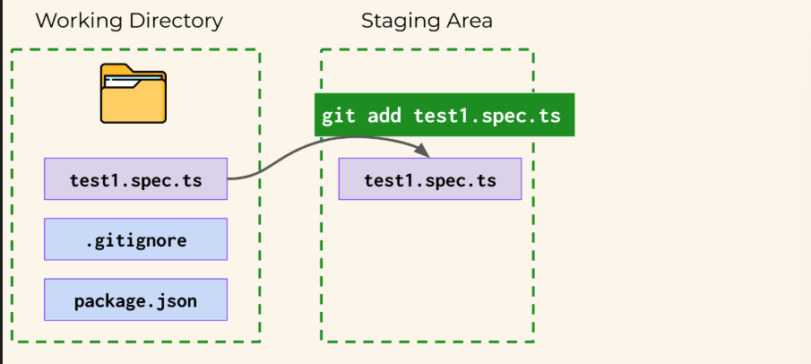
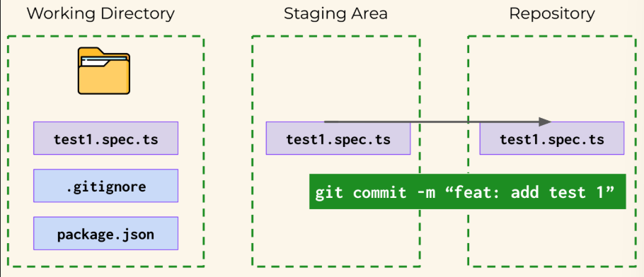
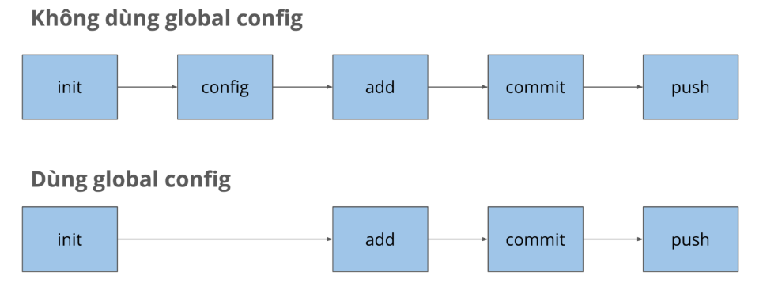

I. Verion control system (VSC)
- Là hệ thống cho phép lưu lại lịch sử thay đổi của file và thư mục.

Type: 
- Local: lưu ở máy cá nhân.
- Centralize: lưu ở máy chủ tập trung (SVN).
- Distributed: lưu ở nhiều máy khác nhau (GIT).

II. GIT:
- Nơi để quản lý phiên bản và làm việc giữa nhiều người với nhau.
- Dễ dùng, hỗ trợ branching modal, tốc độ xử lý nhanh.
- Free và phổ biến.
- Phân biệt Git và GitHub: Git là công cụ quản lý phiên bản giúp đưa file vào repository, còn GitHub là nơi để upload repository.

1. States: working directory (W), statging area (S), repository (R)

2. git init: khởi tạo vùng làm việc của Git, đưa file vào vùng W

3. git add . : thực hiện snapshot và đưa vào vùng S

4. git commit -m"abc" : đưa file vào vùng R với msg "abc"

5. Các câu lệnh thường dùng:

| Lệnh                                            | Chức năng                               |
|-------------------------------------------------|-----------------------------------------|
| Git init                                        | khởi tạo                                |
| Git config user.name "{name}/{email}"           | Cấu hình cho 1 repo                     |
| Git config --global user.email "{name}/{email}" | Cấu hình cho toàn bộ máy tính (default) |
| Git add .                                       | Thêm toàn bộ file                       |
| Git add file1.txt                               | Thêm 1 file                             |
| Git commit -m"message"                          | Commit                                  |
| Git log                                         | Lấy log                                 |
| Git push origin main                            | Push                                    |

6. Git convention: {type}: {short_description}
- chore: sửa nhỏ lẻ, chính tả, xóa file không dùng tới,...
- feat: thêm tính năng mới, testcase mới
- fix: sửa lỗi 1 test trước đó

7. Git flow

III. Javascript.
1. Variable (Biến)

var {tên biến} = {giá trị};

let {tên biến} = {giá trị};

vd: 

var firstName = "Nhi";

let Age = 25;

gán lại: firstName = "Nhi Tran"

2. Constant (Hằng số): khai báo giá trị không thể thay đổi.

const {tên biến} = {giá trị}

--> So sánh khác nhau giữa var, let, constant
| Loại  | Gán lại | Khai báo lại |
|-------|---------|--------------|
| var   | Có      | Có           |
| let   | Có      | Không        |
| const | Không   | Không        |

3. Data type:String, Number, Bigint, Boolean, Undefined, Null, Symbol, Object.
- String: 'Nhi', "Tran"
- Number: 25, 200
- Boolean: True/false

let name = 'I\'m Nhi';
let isLearningPlaywright = true;
let price = 200;

- Comparation operator: >, <, ==, ===, !=, !==, >=, <=
- Unary operator: i++ = i=i+1, i-- = i=i-1
- Arithmetic operator: +,-,*,/
- Conditional:

const temp = 30

if temp < 30 {
    console.log('Trời mát')
};

if temp >= 30 {
    console.log('Trời nóng')
};

- Loops: for({khởi tạo};{đk dừng};{đk tăng})

for (let i = 1; i<= 7; i = i+1) {
    console.log(i);
}