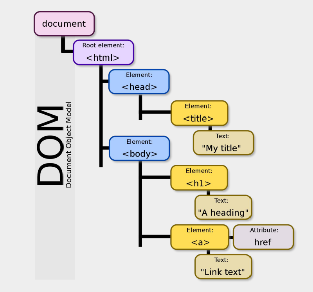

# LESSON 5: DOM terminology & Playwright basic

## I. Function advance.

1. Lamda function (arrow function).

    | Kiểu hàm            | Cú pháp                                   |
    |---------------------|-------------------------------------------|
    | Truyền thống        | `function tenHam(p1, p2) { ... }`         |
    | Arrow (cơ bản)      | `const tenHam = (p1, p2) => { ... }`      |
    | Không có param      | `const ham = () => { ... }`               |
    | Một param           | `const ham = x => { ... }`                |
    | Một dòng trả về     | `const ham = (a, b) => a + b`             |
    | Một dòng lệnh (log) | `const ham = (a, b) => console.log(a, b)` |

2. Anonymous fucntion: là hàm ***không có tên*** thường dùng đề:
- gọi ***một lần***
    ```
    (function () {
    console.log("Đây là hàm không tên");
    })();
    ```

- dùng làm đối số cho hàm khác (callback)
    ```
    setTimeout(function () {
        console.log("delay 3s")
    },3000);

## II. DOM (Document object model)

1. Overview.

    

2. Các thẻ HTML thường dùng.

    | Thẻ HTML                  | Mô tả                                                                                                |
    |---------------------------|------------------------------------------------------------------------------------------------------|
    | `<div>`                   | Chia khối trong trang web (divide)                                                                   |
    | `<h1>` đến `<h6>`         | Tạo tiêu đề (heading), theo cấp độ từ lớn đến bé                                                     |
    | `<form>`                  | Tạo một form thông tin                                                                               |
    | `<input>`                 | Nhập liệu, có nhiều kiểu như: `text`, `email`, `radio`, `checkbox`, `file`, `color`, `range`, `date` |
    | `<textarea>`              | Ô nhập nhiều dòng                                                                                    |
    | `<input type="radio">`    | Nút chọn một (radio button)                                                                          |
    | `<input type="checkbox">` | Nút chọn nhiều (checkbox)                                                                            |
    | `<select>`                | Tạo danh sách chọn (dropdown)                                                                        |
    | `<button>`                | Tạo nút bấm                                                                                          |
    | `<table>`                 | Tạo bảng dữ liệu                                                                                     |
    | `  - <thead>`             | Phần đầu bảng (heading)                                                                              |
    | `  - <tbody>`             | Phần thân bảng (dữ liệu)                                                                             |
    | `  - <tr>`                | Một dòng trong bảng (table row)                                                                      |
    | `  - <th>`                | Ô tiêu đề (table heading – in đậm)                                                                   |
    | `  - <td>`                | Ô dữ liệu (table data)                                                                               |
    | `<input type="date">`     | Bộ chọn ngày (date picker)                                                                           |
    | `<input type="range">`    | Thanh trượt (slider)                                                                                 |
    | `<iframe>`                | Hiển thị nội dung web khác trong trang hiện tại                                                      |


## III. Selector.
1. Overview.
- Là các phần tử trên trang.
- Có nhiều kiểu:
    - XPath selector (XML path)
    - CSS selector.
    - Playwright selector.

2. XPath selector = XML Path
- Có 2 loại:
    - Tuyệt đối: đi dọc theo cây DOM, bắt đầu bởi `/`
        ```
        /html/body/div/p
        ```
    - Tương đối: tìm dựa theo đặc tính như Id, class, type ... bắt đầu bởi `//` → Nên dùng
        ```
        //input[@id='email']
        
## IV. Playwright basic syntax.

1. Tạo file test: /tests/<name>.spec.ts
2. Basic actions

- `Navigate`
    ```
    await page.goto('https://material.playwrightvn.com/01-xpath-register-page.html');
- `Click`
    ```
    await page.locator("//button[@type='submit']").click(); → single click

    await page.locator("//div[@id='clickArea']").dblclick(); → double click

    await page.locator("//div[@id='clickArea']").click({button: "right"}); → click chuột phải

    await page.locator("//div[@id='clickArea']").click({
        modifiers: ["Shift", "Control"],
        timeout: 3000
    });   → click với tổ hợp phím          

    ```

- `Input`:
    ```
    //fill: dán trực tiếp
        await page.locator("//input[@id='username']").fill("K15-Class");
    
    //pressSequentially: gõ từng chữ + delay
     await page.locator("//input[@id='email']").pressSequentially("trantuyetnhi22032000@gmail.com", {
        delay: 150 // 150ms giữa mỗi ký tự
    });
- `Radio`
    ```
    //radio
    await page.locator("//input[@id='male']").check(); -- check vào radio
    const isChecked = await page.locator("//input[@id='male']").isChecked(); --- kiểm tra xem đã check chưa
    console.log(isChecked); -- true: đã check, fasle: chưa check

- `Checkbox`
    ```
    await page.locator("//input[@id='reading']").check();
    const isCBChecked = await page.locator("//input[@id='reading']").isChecked();
    console.log(isChecked);

    //uncheck dùng setChecked
    await page.locator("//input[@id='reading']").setChecked(false);

- `Select option`
    ```
    await page.locator("//select[@id='country']").selectOption({
        value: "canada"
    })

- `set Input file`
